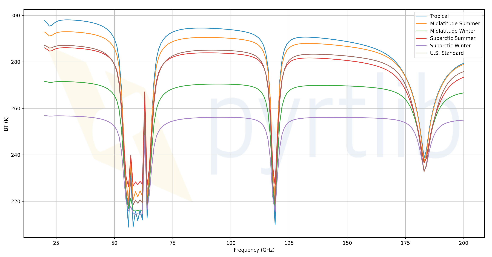

.. pyrtlib documentation master file, created by sphinx-quickstart on Fri Mar 19 09:49:16 2021.
   You can adapt this file completely to your liking, but it should at least contain the root `toctree` directive.

Welcome to pyrtlib's documentation!
====================================================

pyrtlib is a python tool that provides a set of
functions and classes for simulating ........

The source code for pyrtlib python package is hosted on `github
<https://github.com/slarosa/pyrtlib>`_.

Example:
--------
Atmospheric profile definition:

>>> z, p, _, t, md = atmp.gl_atm(atmp.TROPICAL)

Units conversion:

>>> gkg = ppmv2gkg(md[:, atmp.H2O], atmp.H2O)

Relative humidity of H2O (water vapor)

>>> rh = mr2rh(p, t, gkg)[0] / 100

Deifinition of angles and frequencies:

>>> ang = np.array([90.])
>>> frq = np.arange(20, 201, 1)

Initialization of liquid and ice array (not used in clear-sky):

>>> denliq = np.zeros(z.shape)
>>> denice = np.zeros(z.shape)
>>> cldh = np.zeros((2, 0))

Execution of the main script:

>>> df = tb_cloud_rte(z, p, t, rh, denliq, denice, cldh, frq, ang,
...         absmdl='rose16',
...         ray_tracing=True,
...         from_sat=True)
>>> df.tbtotal
0      297.391838
1      296.186240
2      294.748245
3      294.953483
4      296.027799
         ...
176    275.997899
177    276.611319
178    277.129218
179    277.566840
180    277.936645
Name: tbtotal, Length: 181, dtype: float64

.. toctree::
   :maxdepth: 3
   :caption: Installation:

   installation

.. toctree::
   :maxdepth: 3
   :caption: API References:
   
   api

.. toctree::
   :maxdepth: 3
   :caption: Examples:
   
   tutorial
   auto_examples/index

.. toctree::
   :maxdepth: 1
   :caption: References:
   
   references

Indices and tables
==================

* :ref:`genindex`
* :ref:`modindex`
* :ref:`search`

.. |build-docs-action| image:: https://github.com/slarosa/pyrtlib/workflows/build-docs-action/badge.svg
   :target: https://github.com/slarosa/pyrtlib/actions/workflows/build_docs.yml

.. |run-python-tests| image:: https://github.com/slarosa/pyrtlib/workflows/run-python-tests/badge.svg
   :target: https://github.com/slarosa/pyrtlib/actions/workflows/ci.yml

.. |license| image:: https://img.shields.io/github/license/slarosa/pyrtlib.svg
   :target: https://github.com/slarosa/pyrtlib/blob/main/LICENSE.md

.. |GitHub commit| image:: https://img.shields.io/github/last-commit/slarosa/pyrtlib
   :target: https://github.com/slarosa/pyrtlib/commits/main

.. |codecov| image:: https://codecov.io/gh/slarosa/pyrtlib/branch/main/graph/badge.svg?token=7DV4B4U1OZ
   :target: https://codecov.io/gh/slarosa/pyrtlib