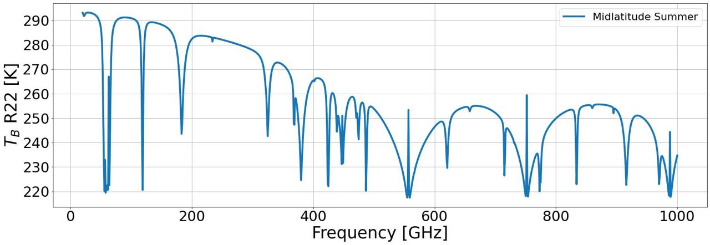

.. .. image:: ../../resources/logo/logo_large_new.png
..   :width: 600

.. pyrtlib documentation master file, created by sphinx-quickstart on Fri Mar 19 09:49:16 2021. 
   You can adapt this file completely to your liking, but it should at least contain the root `toctree` directive.

PyRTlib documentation
=====================

PyRTlib allows to simulate and calculate radiometric parameters and estimting propogation parameters using as input meteorological data.
Some meteorological dataset are built-in in PyRTlib which can be download and used directly in PyRTlib. It considers atmospheric profiles from both radiosounding observations (RAOB) and model reanalysis (ERA5).
RAOB profiles come from Wyoming Upper Air Archive (University of Wyoming) and NCEI’s Integrated Radiosonde Archive version 2 (IGRA2) by the National Climatic Data Center (NCDC) of the National Oceanic and Atmospheric Administration (NOAA).

PyRTlib also allows to quantify absorption model uncertainty due to uncertainty in the underlying spectroscopic parameters. [Cimini-2018]_
The approach is applied to a widely used microwave absorption model [Rosenkranz-2017]_, on which PyRTlib is based, and radiative transfer calculations at any frequencies range, 
which are commonly exploited for atmospheric sounding by microwave radiometer (MWR).  

.. panels::
   :card: + intro-card text-center

   ---
   :img-top: _static/shuttle.svg

   Getting started

   +++

   .. link-button:: installation
      :type: ref
      :text: Go To Reference
      :classes: btn-block btn-outline-primary 

   ---
   :img-top: _static/api.svg

   API references

   +++

   .. link-button:: api
      :type: ref
      :text: Go To Reference
      :classes: btn-block btn-outline-primary 
   
   ---
   :img-top: _static/code.svg
   
   Gallery example

   +++

   .. link-button:: examples/index
      :type: ref
      :text: Go To Reference
      :classes: btn-outline-primary btn-block

.. pyrtlib is a python tool that provides a set of calsses and methods for simulating ........

The source code for pyrtlib python package is hosted on `github
<https://github.com/slarosa/pyrtlib>`_.

.. note::
   The software is intended as an educational tool with limited ranges of 
   applicability, so no guarantees are attached to any of the codes. 

.. .. cssclass:: image-pyrtlib
   
..   .. image:: ../../resources/spectrum_r22.jpeg
      :width: 600
..   .. image:: ../../resources/r98_r22.jpeg
      :width: 600

Quick start
-----------

.. code-block:: python
   
   from pyrtlib.tb_spectrum import TbCloudRTE
   from pyrtlib.climatology import AtmosphericProfiles as atmp
   from pyrtlib.utils import mr2rh, ppmv2gkg

Atmospheric profile definition:

.. code-block:: python
   
   z, p, _, t, md = atmp.gl_atm(atmp.MIDLATITUDE_SUMMER)

Units conversion:

.. code-block:: python
   
   gkg = ppmv2gkg(md[:, atmp.H2O], atmp.H2O)

Relative humidity of :math:`H_2O` (water vapor)

.. code-block:: python

   rh = mr2rh(p, t, gkg)[0] / 100

Deifinition of angles and frequencies:

.. code-block:: python

   ang = np.array([90.])
   frq = np.arange(20, 1001, 1)

Initialize parameters for main execution:

.. code-block:: python

   rte = TbCloudRTE(z, p, t, rh, frq, ang)

Set absorption model:

.. code-block:: python

   rte.init_absmdl('R22SD')

Execute model by computing upwelling radiances:

.. code-block:: python

   df = rte.execute()
   df.tbtotal
   0      293.119811
   1      292.538088
   2      291.736672
   3      291.913658
   4      292.493971
            ...    
   976    230.179993
   977    231.435965
   978    232.592915
   979    233.666322
   980    234.667522
   Name: tbtotal, Length: 981, dtype: float64

Preview of the output dataframe (see :py:meth:`pyrtlib.tb_spectrum.TbCloudRTE.execute` for more info):

.. list-table::
   :widths: 25 25 25 25 25 25 25 25
   :header-rows: 1

   * - tbtotal
     - tbatm
     - tmr
     - tmrcld
     - tauwet
     - taudry
     - tauliq
     - tauice
   * - 293.119811	 
     - 0.0 
     - 282.644145
     - 0.0
     - 0.085189
     - 0.012949
     - 0.0
     - 0.0
   * - 292.538088	    
     - 0.0      
     - 282.188067    
     - 0.0       
     - 0.135297    
     - 0.013615   
     - 0.0       
     - 0.0
   * - ...
     - ...
     - ...
     - ...
     - ...
     - ...
     - ...
     - ...
   * - 234.667522    
     - 0.0      
     - 234.667522    
     - 0.0       
     - 474.835275   
     - 0.329120   
     - 0.0      
     - 0.0 

Plotting result:

  
Installation
------------

.. toctree::
   :maxdepth: 2

   installation

API References
--------------

.. toctree::
   :maxdepth: 2
   
   api

Gallery Example
---------------

.. toctree::
   :maxdepth: 2
   
   examples/index

References
----------

.. toctree::
   :maxdepth: 1
   
   references

Indices and search
------------------

* :ref:`genindex`
* :ref:`search`

.. |build-docs-action| image:: https://github.com/slarosa/pyrtlib/workflows/build-docs-action/badge.svg
   :target: https://github.com/slarosa/pyrtlib/actions/workflows/build_docs.yml

.. |run-python-tests| image:: https://github.com/slarosa/pyrtlib/workflows/run-python-tests/badge.svg
   :target: https://github.com/slarosa/pyrtlib/actions/workflows/ci.yml

.. |license| image:: https://img.shields.io/github/license/slarosa/pyrtlib.svg
   :target: https://github.com/slarosa/pyrtlib/blob/main/LICENSE.md

.. |GitHub commit| image:: https://img.shields.io/github/last-commit/slarosa/pyrtlib
   :target: https://github.com/slarosa/pyrtlib/commits/main

.. |codecov| image:: https://codecov.io/gh/slarosa/pyrtlib/branch/main/graph/badge.svg?token=7DV4B4U1OZ
   :target: https://codecov.io/gh/slarosa/pyrtlib